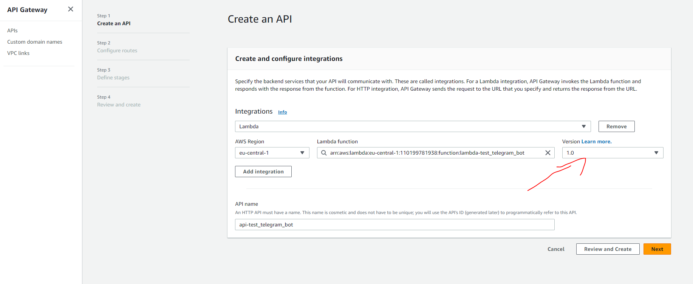
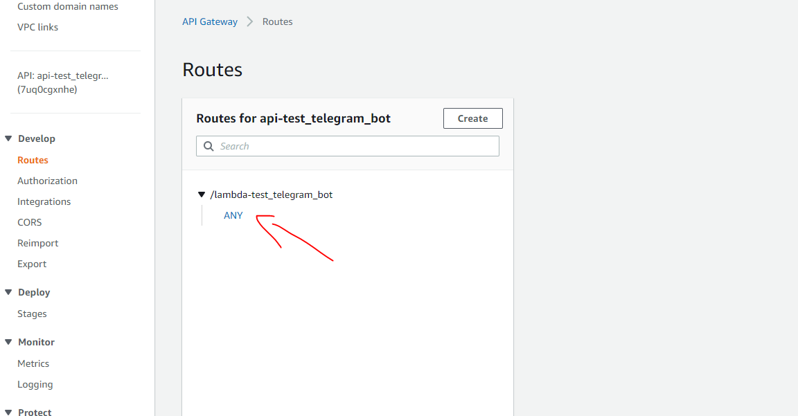
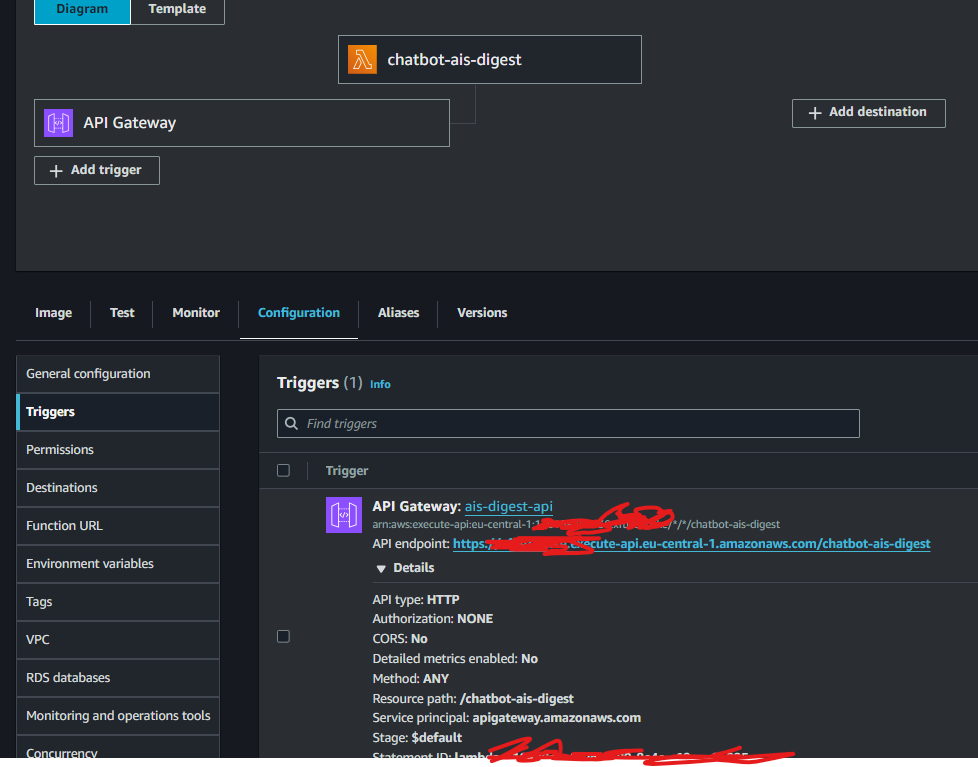

AI Safety Digest Telegram bot

# Features
- LLM provider agnostic: It is built with langchain to it is pretty straightforward to change the codes to work with other LLMs (e.g. Claude, ...)
- Easy to setup. Instructions bellow. For the deployment of your bot's function you just need to run one python file.

# Setup instructions
## General Notes
- Everything here is for a bot named AIS_Digest that runs on AWS and for a local version of the same bot called in telegram AIS_Digest_local. Change the names accordingly for your bot. This involves changing the names of the "chatbot-ais-digest" folder (because the naming will used in some scripts to name some variables automatically), and in the local_test_bot.py
- After cloning the repo you should frist run ``pipenv install`` to setup a new pipenv venv with the proper libraries  
- If you face problems raise reproducing it raise an issue in Github
- Set up the .env file: Create a file named `.env` containing the same info as `.env.example` . You should fill it in as you progress through this instructions

## Telegram
- Set up 2 bots as done in this [tutorial>Setting up the Telegram bot
](https://dev.to/epam_india_python/telegram-ai-bot-creation-using-chatgpt-and-aws-lambda-python-5f6g)
- If you want to add a menu to your chatbot you can do it in the conversation with the BotFather. Select your chatbot under /mybots then "Configure Menu button" then select again your chatbot and "Edit commands", e.g. "new - Start new conversation"

## AWS
To run the later deployment.py script successfully, you need to set up a AWS account and configure the AWS CLI:

1. Create an AWS account:
   - Go to https://aws.amazon.com/
   - Click on "Create an AWS Account"
   - Follow the prompts to create your account

2. Set up an IAM user:
   - Log in to the AWS Management Console
   - Search for "IAM" and go to the IAM dashboard
   - Click on "Users" in the left sidebar, then "Add user"
   - Choose a username and select "Programmatic access"
   - For permissions, choose "Attach existing policies directly" and select "AdministratorAccess" (Note: In a production environment, you'd want to limit permissions, but for this setup, we'll use full access)
   - Complete the user creation process
   - At the final step, you'll see the Access Key ID and Secret Access Key. Keep this page open or download the CSV file

3. Install the AWS CLI:
   - Go to https://aws.amazon.com/cli/
   - Download and install the AWS CLI for your operating system

4. Configure the AWS CLI:
   - Open a terminal or command prompt
   - Run the command: `aws configure`
   - You'll be prompted to enter the following:
     - AWS Access Key ID: Enter the Access Key ID from step 2
     - AWS Secret Access Key: Enter the Secret Access Key from step 2
     - Default region name: Enter your preferred AWS region (e.g., us-east-1, eu-west-1)
     - Default output format: Enter 'json'

5. Create an S3 bucket:
   - Log in to the AWS Management Console
   - Go to the S3 service
   - Click "Create bucket"
   - Choose a unique name for your bucket (add this to the S3_BUCKET value in your .env file, e.g. "ais-digest")
   - Configure the bucket settings as needed
   - Create the bucket

## Deployment
- There are 2 chatbots so that you can use the local_test_bot.py for debugging in the "_local" chatbot. When you run the deployment.py file the lambda-main.py should be automatically updated and deployed to AWS so that it works as your local bot.  
- Start Docker Desktop. Necessary for the deployment.py to build the container image with the codes of your chatbot.
- The local_test_bot.py already has a working functionality so you can just run deployment.py.
- deployment.py will create or update an ECR repository, build and push a Docker image, and create or update a Lambda function using that image.

## A bit more AWS (API Gateway)
Follow instructions in this [tutorial>HTTP API in the API Gateway service
](https://dev.to/epam_india_python/telegram-ai-bot-creation-using-chatgpt-and-aws-lambda-python-5f6g).  
Note: so that the API Gateway can trigger the lambda you have to select the version 1.0 for the lambda when creating the HTTP API.

Also the route has to be ANY and not POST cause otherwise does not work.

When setting up the webhook you have to use the url that appears in the trigger from the lambda function and not the Invoke URL from the API Gateway.

In my case it looks something like this: `https://api.telegram.org/bot123456:YYYY/setWebhook?url=https://XXXX.execute-api.eu-central-1.amazonaws.com/chatbot-ais-digest`

# Test and deploy
You can test by writing in your telegram to the local version on your bot and then running/debugging locally local_test_bot.py. Once it is working locally just run deployment.py to modify the bot in the cloud.